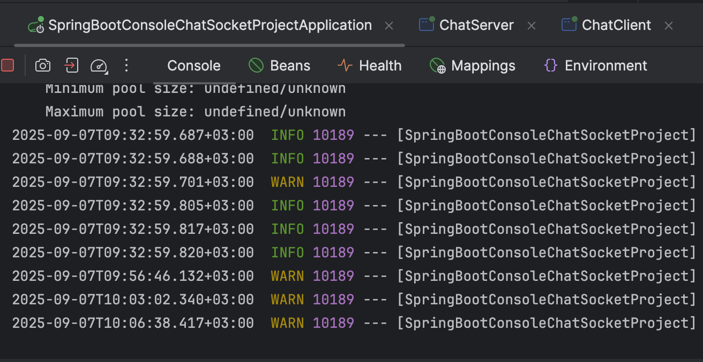
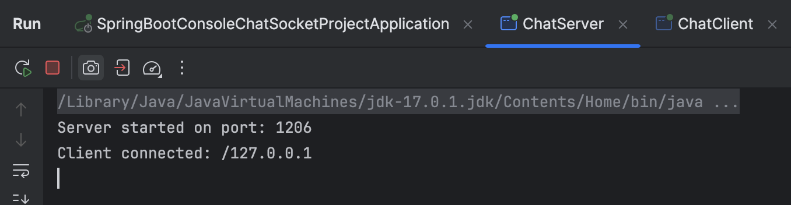
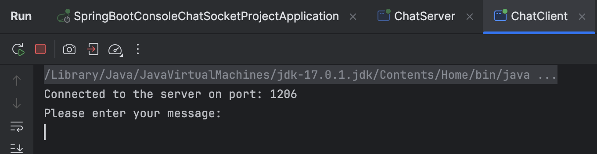
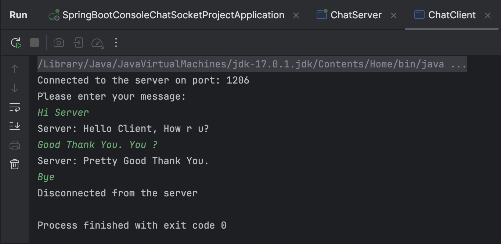
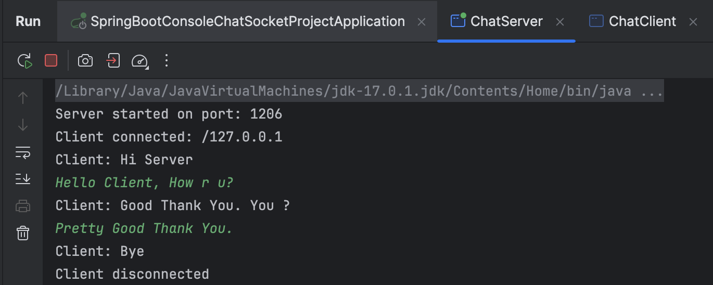
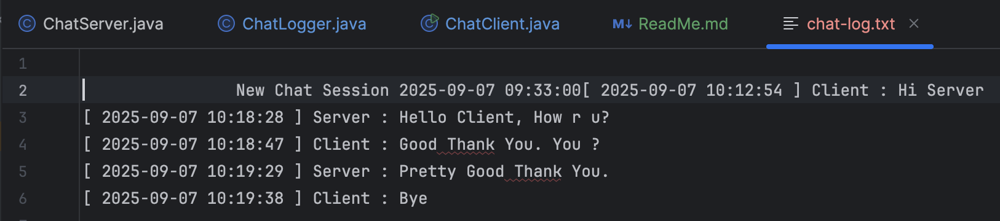
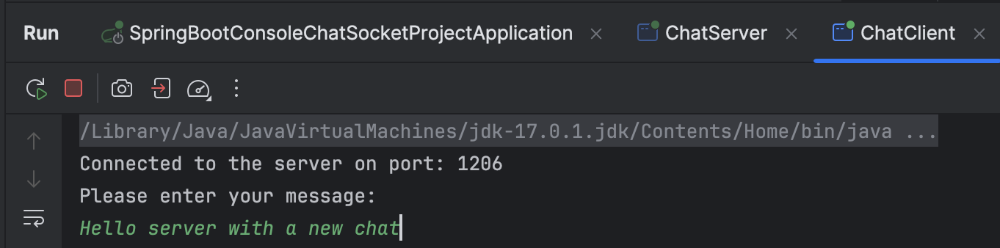
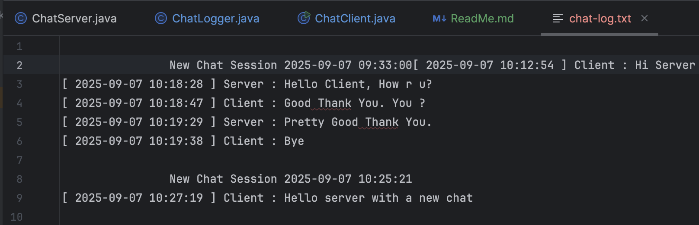
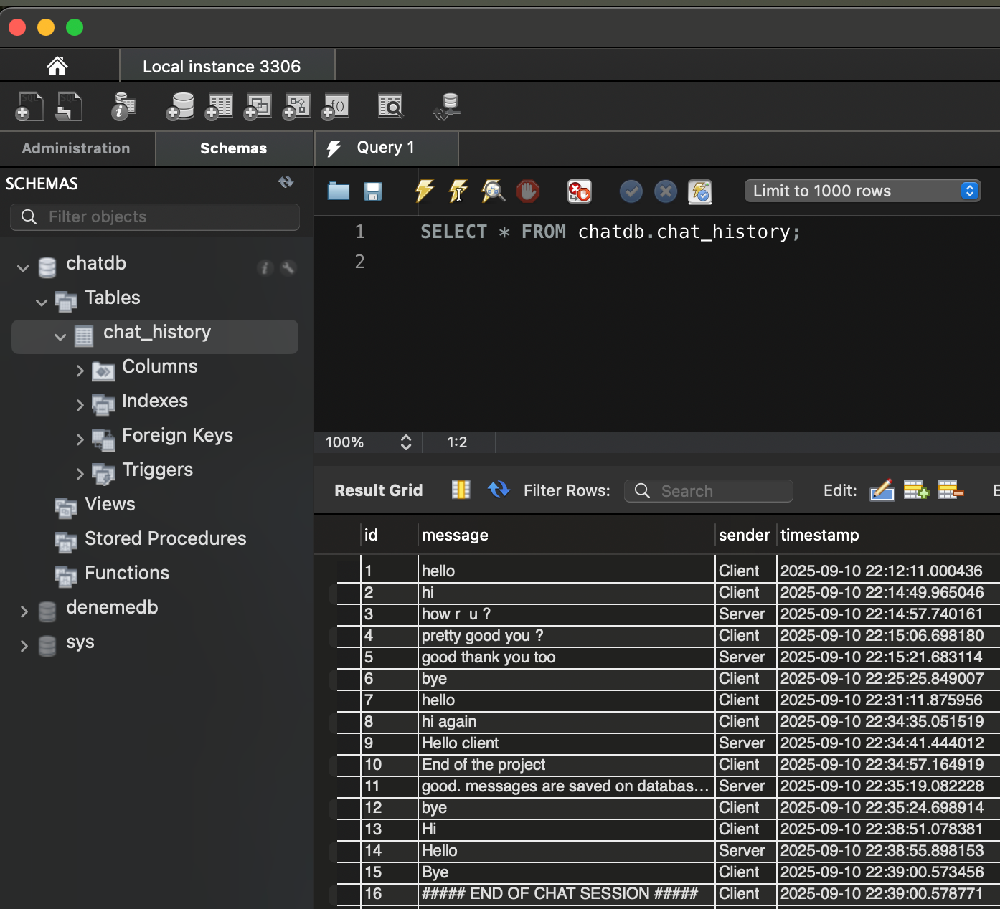

# Spring Boot Console Chat Application
This Project is the closing project of Kodluyoruz / Patika.dev Java Backend Advanced Web Development Course.

## Description
A simple console-based chat application using Java sockets and Spring Boot. Messages are logged with timestamps to a text file.

## Features
- Client-server communication via TCP sockets
- Timestamps on each message
- Chat history saved in `chat-log.txt`
- New chat session header
- Spring Boot integration

## License

This project is free to use, modify, and distribute.  
Citation is appreciated but not required.


## Installation / Setup
1. Clone the repo:
   ```bash
   git clone https://github.com/ayhan-unlu/SpringBootConsoleChatSocketProject

## How to Run

1. Run the Spring Boot application

2. Run ChatServer (first)

3. Run ChatClient

## Screenshots

>Just After Running 3 files
> 
>>
>>
>>
>>
>>

>Just After Chat
> 
>>
>>
>>
>>
>>

>With a new Chat

>>
>>
>>
Clean> 

>Saved to Database

>>